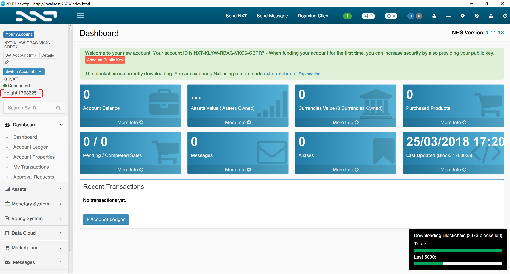

# Proof-of-Stake-Cryptocurrency-generator  [](https://t.me/coin_generator)
Create your own Proof of Stake cryptocurrency with its own blockchain based on "Nxt Blockchain Creation Kit".
It should satisfy the requirements of the Jelurida Public License version 1.1 for the Nxt Public Blockchain Platform.
Basically 10% of your tokens should be given to the owners of the Nxt Cryptocurrency. Furthermore, the source needs to be disclosed and under the same license. Keep in mind that this generator is not perfect!
* Website: https://coingenerator.sh
* Read the story: https://medium.com/learning-lab/how-to-build-your-own-cryptocurrency-proof-of-stake-in-just-a-few-minutes-6d526bca4a91

This generator will assist you building your NXT clone.
If you are an advanced user follow directly the official tutorial:
* Nxt-clone-starter: https://bitbucket.org/Jelurida/nxt-clone-starter
* Introduction to the NXT Blockchain Creation Kit: https://www.youtube.com/watch?v=6Wg3uv07GU4

## What are the Cryptocurrency built with this generator?

* Motive - https://motive.network

## Requirements
* Java
* NodeJS (>= version 8.0)

### How to install Java
* General - Java 8
* Ubuntu - http://www.webupd8.org/2012/09/install-oracle-java-8-in-ubuntu-via-ppa.html
* Debian - http://www.webupd8.org/2014/03/how-to-install-oracle-java-8-in-debian.html
* FreeBSD - pkg install openjdk8

### How to install NodeJS
* General - https://nodejs.org/en/download/

## Step 1 - Download the Nxt blockchain and create the genesis block
1. Clone this repository with `git clone https://github.com/sandoche/Proof-of-Stake-Cryptocurrency-generator`, also feel free to fork this repository!
2. Go to the cloned folder and install the npm dependencies with `npm install`
3. Run the Nxt Blockchain with `npm run nxt`
4. Then open http://localhost:7876/index.html in your favourite browser. Then create an account and save the private keys securely, wait until the full blockchain is synced, this can take a few hours. Copy your nxt address and also its public key.
5. Open the file `docs/config/newGenesisAccounts.json`, this file will define the repartition of the coins your are creating. On the first block creation 1 billion of coins will be distributed, 10% of them will be distributed to the Nxt holders (this is part of the Jelurida Public License). You have to put the list of accounts you want to credit in the first block (the genesis block) and its matching public key. The total of the amounts should be 90000000000000000 if you don't know what to do, just put your NXT address your created (Step 1-4), and it's public key like this and save it. If you are not sure about what you are doing check this video: https://www.youtube.com/watch?v=6Wg3uv07GU4
```
{
    "balances": {
         "my nxt address here": 90000000000000000
     },
     "publicKeys": [
         "the public key of this nxt address"
     ]
 }
```
6. Go to http://localhost:7876/test?requestTag=ADDONS click on "downloadJPLSnapshot" then upload your file "newGenesisAccounts.json" and copy paste the height you can see in your wallet as in the screenshot below, then submit. A file will be generated after a few minutes, save it as "genesisAccounts.json" in the `templates/conf/data` folder.

7. Create another account (like in Step 1.4), and save its public address in the file `templates/conf/data/genesisParameter.json`, also edit the epochBeginning with the current date.

## Step 2 - Create your own Cryptocurrency
1. Update the images from `templates/img` according to your blockchain images and the favicon in `templates`
2. Then just run `npm run generate` and answer the generator's questions. The generator will automatically clone the nxt-clone-starter, change the port and name in the source code. For Windows user you should use `npm run generate:docker` and have docker installed.
3. Once the cryptocurrency generated you can of course edit the interface inside the `<yourCrypto>/html` folder and find the java source in `<yourCrypto>/src/java`, note that you can find many parameters that you can edit in the following file `<yourCrypto>/src/java/nxt/Constants.java`
4. Run it ! Go to `<yourCrypto>` folder compile with  `sh ./compile.sh` (or win-compile.sh for Windows) then run with `sh ./run.sh` (or run.bat for windows). Note that you can delete all the other folders they are now useless. Also you need to start forging yourself if you want to try to make transactions.
5. Find the API doc in the `doc` folder

## Step 3 - Create the installer for the wallet (optionnal)
* In order to build, please read the [build documentation](BUILD-README.md)

## Step 4 - Host your nodes in some servers
Once your cryptocurrency ready for deployement, you need to host some nodes online. These nodes will share the transactions with other nodes, validates transactions, and forge blocks.
You can do that in any virtual machine, you can use for example Amazon Web Services, or OVH. Once you have your virtual machine. Here is how to do:
1. Connect to the machine, I recommend Ubuntu or Debian
2. Clone your cryptocurrency
3. Install java
4. Open as an Inboud and Outbound TCP Port the "Peer port" that you chose when you run the generator, you can find it also in the `<yourCrypto>/src/java/nxt/peer/Peers.java` as `DEFAULT_PEER_PORT`
5. Run `screen` and run the node with `sh ./run.sh` after  `sh ./compile.sh`
6. You now need to run the forging mode of your node, in order to do that you can either do in command line following this do it also inside  `screen` to let it forge: `curl -d requestType=startForging -d secretPhrase="<passphrase>" http://localhost:<port>/nxt` don't forget of course to replace the <port> of the API port, and the <passphrase> with the passphrase of an account that has enough effective balance to forge.
If the command line to launch forging does not work you can do it with the GUI after, installing a vnc server check the following links:
* https://medium.com/@Arafat./graphical-user-interface-using-vnc-with-amazon-ec2-instances-549d9c0969c5
* https://www.digitalocean.com/community/tutorials/how-to-set-up-vnc-server-on-debian-8

## Troubleshooting
### Mac & Linux
* If step 1 doesn't work go to the `nxt` folder and run `sh ./compile.sh` then `sh ./run.sh`
### Windows
* If step 1 doesn't work go to the `nxt` folder and run `sh ./win-compile.sh` then open `run.bat`
* For step 2 you need to use Docker, so first install docker and then run `npm run generate:docker` or `docker run -it --rm --name coin-generator -v "$PWD":/usr/src/app -w /usr/src/app node:8 npm run generate`
### All OS
* Sometime when running the wallet it's not logging in, open the wallet url in private navigation

## What is next?
* You can find the source of the mobile app in the `mobile` folder

## ⭐️ Show your support
Please ⭐️ this repository if this project helped you!

<a href="https://www.patreon.com/sandoche">[](https://www.patreon.com/sandoche)</a>

## Buy me a beer
If you like this project, feel free to donate:
* Bitcoin: 19JiNZ1LkMaz57tewqJaTg2hQWH4RgW4Yp
* Ethereum: 0xded81fa4624e05339924355fe3504ba9587d5419
* Monero: 43jqzMquW2q989UKSrB2YbeffhmJhbYb2Yxu289bv7pLRh4xVgMKj5yTd52iL6x1dvCYs9ERg5biHYxMjGkpSTs6S2jMyJn
* Motive: MOTIV-25T5-SD65-V7LJ-BBWRD (Get Motive Now: https://motive.network)
* Paypal: https://www.paypal.me/kanbanote
